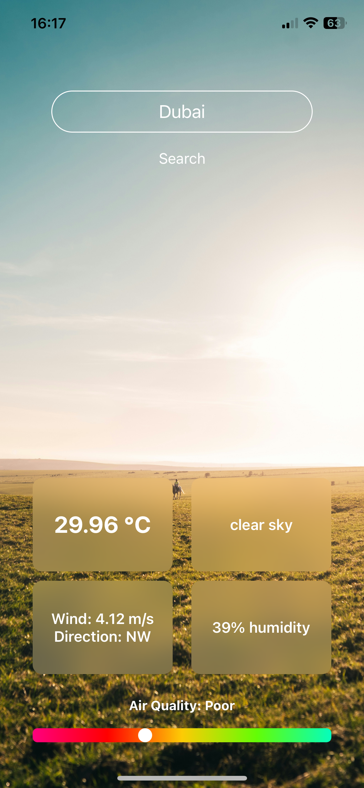
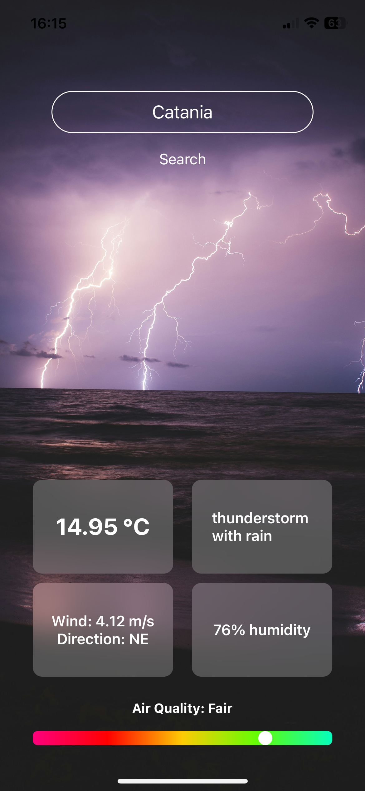
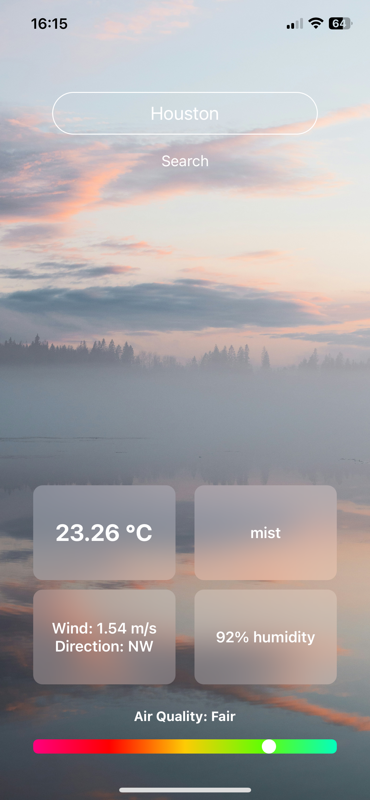
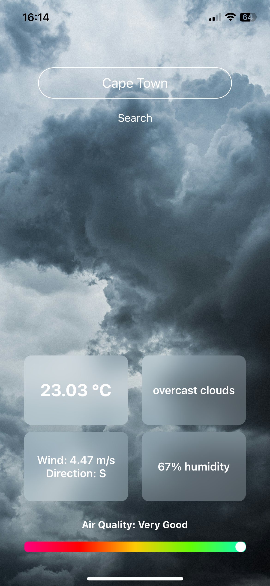

# Weather App

## Overview
Weather App is a sleek and intuitive React Native application that provides users with real-time weather information. Powered by the OpenWeatherAPI, it delivers accurate and up-to-date data on temperature, weather conditions, wind speed and direction, humidity levels, and air quality. The application also features a dynamic linear graph to visualize air quality levels.

## Features
- **Search City Functionality**: Users can search for any city worldwide to retrieve weather data.
- **Temperature**: Displays current temperature readings.
- **Weather Conditions**: Provides detailed descriptions (e.g., sunny, cloudy, rainy).
- **Wind Information**: Showcases both wind speed and direction, with cardinal directions for ease.
- **Humidity**: Presents humidity levels as a percentage.
- **Air Quality Visualization**: Air quality is represented in an easy-to-read linear graph.

## Tech Stack
- **React Native**: Frontend framework for building cross-platform mobile apps.
- **OpenWeatherAPI**: API for fetching reliable and accurate weather data.

## Installation
To run this project locally, follow these steps:

1. Clone the repository:
```bash
   git clone https://github.com/paolo-licata/weather-app.git
   cd weather-app
```

2. Install dependencies:
```bash
   npm install
```

3. Add your OpenWeatherAPI key:
    - Create an .env file in the root directory.
    - Add your API key:
    ```bash
        WEATHER_API_KEY=your-api-key
    ```

4. Start the application:
```bash
   npm start
```

## Usage
- Open the app and use the search functionality to find a city's weather information.
- Explore the weather details, including temperature, conditions, wind, humidity, and air quality graph.

## Screenshots





## Author
Paolo Licata